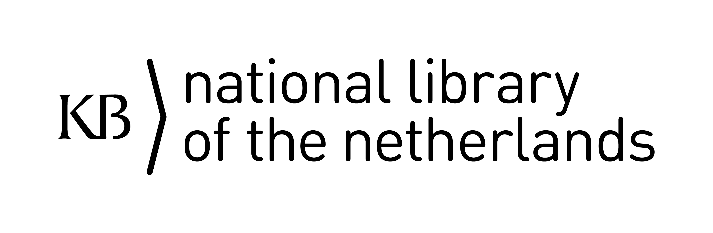

<table width="100%" border="0"><tr><td align="left">
<a href="https://kbnlwikimedia.github.io/stories/"><< Back to stories index</a>
</td><td align="right">
<a href="https://github.com/KBNLwikimedia/GLAMorousToHTML/tree/master/stories" target="_blank">>> To the Github repo of this page</a>
</td></tr></table>

# Public outreach and reuse of Delpher images via Wikipedia and Wikimedia Commons, July 2025 
Olaf Janssen, xx July 2025

This article is also [available as a PDF](https://xxxxxxxxx).

_**Delpher** biedt toegang tot miljoenen gedigitaliseerde pagina's uit Nederlandse historische kranten, boeken en tijdschriften. Het is een veelgebruikte bron in de Nederlandstalige Wikipedia. 

Nadat we eerder keken naar [Delpher-URLs in WP:NL](https://kbnlwikimedia.github.io/KB-Wiki-Stats-Graphs/stories/Het%20gebruik%20van%20Delpher%20in%20Nederlandstalige%20Wikipedia-artikelen,%20januari%202025.html) en naar het Publieksbereik en hergebruik van  [afbeeldingen uit de KB-efgoedcollecteis](https://kbnlwikimedia.github.io/KB-Wiki-Stats-Graphs/stories/Reuse%20indicators%20for%20KB%20images%20in%20Wikipedia%20and%20Wikimedia%20Commons%2C%20the%202023%20update.html) via WP, kijken we nu naar het gebruik van Delpher-afbeeldingen in Wikipedia.

In dit artikel bekijken we xxxxxx._

><big><b><em>Leuke quoate</em></b></big>

The key findings (per dd mm 2025) fron this article are:

https://kbnlwikimedia.github.io/GLAMorousToHTML/site/MediafromDelpher_Wikipedia_NS0_07052025.html

* van de 62.259 beschikbare Delpher-bestanden (zie ook KPI 2) worden
* in totaal 1.264 unieke bestanden 2.575 keer gebruikt (hergebruik van 2,0%)
* in 2.321 unieke WP-artikelen, waarvan hier een overzicht uitgesplitst per taalversie dd 07-05-2025 (1 artikel kan meerdere Delpher-bestanden bevatten, en Delpher-bestanden en WP-artikelen hebben een veel-op-veel relatie).
* in 83 taalversies, met dd 07-05-2025 de Nederlandstalige op kop (867) artikelen, gevolgd door de Engelstalige (295), Duitse en Welshe Wikipedia's.

## Links naar Delpher in Nederlandstalige Wikipedia-artikelen 

De Nederlandstalige Wikipedia maakt veelvuldig gebruik van informatie uit Delpher om in artikelen te verwerken. Vanuit zo'n lemma wordt dan door middel van één of meerdere URLs terugverwezen naar de gebruikte broninformatie in Delpher. Dit kan bijvoorbeeld een link zijn naar een specifiek krantenartikel, een gedigitaliseerd boek, een bepaalde pagina in een tijdschrift, een hele PDF van een publicatie, of een zoekopdracht in radiobulletins. Laten we een aantal voorbeelden bekijken:

_In kranten:_
 
* Het artikel [Aethernieuws](https://nl.wikipedia.org/wiki/Aethernieuws) verwijst naar een [overzicht van 67 afleveringen](https://www.delpher.nl/nl/kranten/results/index?page=1&cql%5B%5D=ppn%3D046286330&coll=dddtitel) van dit verzetsblad uit de Tweede Wereldoorlog op Delpher.
* In het lemma over [Abraham Asscher (1884-1926)](https://nl.wikipedia.org/wiki/Abraham_Asscher_(1884-1926)) staat een link naar een [PDF van de aflevering van 14 maart 1919](https://resolver.kb.nl/resolve?urn=ddd:010859722:mpeg21:pdf) van het _Nieuw Israëlietisch Weekblad_, waarin een artikel over Opperrabbijn A. Asscher te lezen is.
* [Pagina 8 van de _Amigoe_ van 04-07-1985](https://resolver.kb.nl/resolve?urn=ddd:010643132:mpeg21:p008) bevat informatie over een expositie van Surinaamse kunstenaars in Curaçao die in het artikel over de Amsterdamse decorontwerper, tekenaar, schilder en journalist [Nic Loning](https://nl.wikipedia.org/wiki/Nic_Loning) is verwerkt.
* Het artikel over [10 jaar Bassie & Adriaan](https://nl.wikipedia.org/wiki/10_jaar_Bassie_%26_Adriaan) verwijst naar een [krantenartikel van 19-10-1984](https://resolver.kb.nl/resolve?urn=ddd:010593326:mpeg21:a0154) in het _Limburgsch dagblad_ waarin een optreden van het duo in _[De Blufshow](https://kindertvgeheugen.nl/series/serie-overzicht/5915-blufkwis-de-blufshow-de-1983-1987)_ van [Hans Kazàn](https://nl.wikipedia.org/wiki/Hans_Kaz%C3%A0n) wordt aangekondigd.
* In maart 1991 vochten Joep Jansen (codenaam _Max_) en [Willem Schoemaker](https://nl.wikipedia.org/wiki/Willem_Schoemaker_(1920-2003)) (codenaam _Miki_) voor de Utrechtse rechtbank uit wie de ware oprichter van de WO2-spionagegroep [Geheime Dienst Nederland](https://nl.wikipedia.org/wiki/Geheime_Dienst_Nederland) zou zijn. Diverse kranten [schrijven hierover](https://www.delpher.nl/nl/kranten/results?query=miki+max+rechtbank+utrecht&coll=ddd&sortfield=date).
* In het artikel over [Nico Bolkestein](https://nl.wikipedia.org/wiki/Nico_Bolkestein) wordt verwezen naar de [platte tekst van een krantenartikel](https://resolver.kb.nl/resolve?urn=ddd:010628816:mpeg21:a0108:ocr#:~:text=bolkestein) waarin het overlijden van deze politicus en PvdA-bestuurder genoemd wordt. Het is niet meteen manifest uit welk krantenartikel deze tekst afkomstig is, maar na enig zoekwerk blijkt dit de personaliarubriek in het [_Nederlands dagblad_ van 12-1993](https://www.delpher.nl/nl/kranten/view?coll=ddd&identifier=ddd:010628816:mpeg21:a0108) te zijn. 

_In boeken_

*Illustratie door Theo Ortmann in het boek [Onmaatschappelijke voorkeur](https://resolver.kb.nl/resolve?urn=MMKB06:000002985) van Mary Dorna uit 1938. - [Bron](https://resolver.kb.nl/resolve?urn=MMKB06:000002985:00019), publiek domein.*

* In het artikel [Studentencorps](https://nl.wikipedia.org/wiki/Studentencorps#Studentensoci%C3%ABteit) wordt uitgelegd wat de oudste nog bestaande studentensociëteit in Nederland is. Daarbij wordt gebruik gemaakt van het boek _[Studentenleven](https://www.delpher.nl/nl/boeken1/gview?coll=boeken1&identifier=a91WAAAAcAAJ)_ van [Klikspaan](https://nl.wikipedia.org/wiki/Johannes_Kneppelhout) uit 1844. 
* De Duitse kunstenaar [Theo Ortmann](https://nl.wikipedia.org/wiki/Theo_Ortmann) (1902-1941) heeft het boek _Onmaatschappelijke voorkeur_ van [Mary Dorna](https://nl.wikipedia.org/wiki/Mary_Dorna) uit 1938 geïllustreerd. Op pagina 13 maakte hij een [illustratie van een rokende man in een stoel op het strand](https://resolver.kb.nl/resolve?urn=MMKB06:000002985:00019). 
* Bij een uitleg over [voormalige Nederlandse loodsvlaggen](https://nl.wikipedia.org/wiki/Loods_(scheepvaart)#Voormalige_Nederlandse_loodsvlaggen) wordt gebruik gemaakt van het [zoekwoord 'loodsvlag'](https://www.delpher.nl/nl/boeken/view?coll=boeken&identifier=MMKB06:000008238:00021&objectsearch=loodsvlag) in het boek _Jongens en techniek, Schepen-havens-kranen-kanalen-sluizen-bruggen-centrifugaalpompen_ uit 1938. 
* In het lemma over de [Doelisten](https://nl.wikipedia.org/wiki/Doelistenbeweging) - een 18e eeuwse prinsgezinde burgerbeweging in Amsterdam - staat een literatuurverwijzing naar een [PDF van het boek _Revolutiedagen in Amsterdam_](https://resolver.kb.nl/resolve?urn=MMKB06:000001542:pdf) van P.C.A. Geyl uit 1936.

_In tijdschriften_

* Het artikel over het Nederlands tijdschrift voor de fotografie [Lux](https://nl.wikipedia.org/wiki/Lux_(tijdschrift)) (1889-1927) bevat een link naar [280 gescande edities](https://www.delpher.nl/nl/tijdschriften/results?facets%5BalternativeFacet%5D%5B%5D=Lux&page=1&maxperpage=50&sortfield=date&coll=dts) van dit tijdschrift die in Delpher beschikbaar zijn. 
* Op [pagina 346](https://resolver.kb.nl/resolve?urn=MMKB13:002743002:00350) (en verder) van het _Tijdschrift der Nederlandsche Maatschappij ter Bevordering van Nijverheid_ uit 1898 wordt een beschrijving gegeven van de voormalige kleding- en ondergoedproducent [Jansen & Tilanus](https://nl.wikipedia.org/wiki/Jansen_%26_Tilanus) uit Vriezenveen. 
* Het artikel over [Dirk Blank](https://nl.wikipedia.org/wiki/Dirk_Blank) verwijst naar een [foto getiteld _Ochtend in't Bosch_](https://www.delpher.nl/nl/tijdschriften/view?coll=dts&identifier=MMNFM01:015879001:00042) in jaargang 9 van het tijdschrift _De camera; modern fotografisch tijdschrift_ waarmee deze Utrechtse fotograaf in december 1916 de eerste prijs van een amateurfotowedstrijd won. 
* Het artikel over het vijfjaarlijkse internationale [World Congress of Philosophy](https://nl.wikipedia.org/wiki/World_Congress_of_Philosophy) bevat een link naar de [PDF van het _Algemeen Nederlandsch tijdschrift voor wijsbegeerte en psychologie_](https://resolver.kb.nl/resolve?urn=MMKB07:000964001:pdf), jaargang 28 van 01-03-1935.
* Het artikel over [Jan Thate](https://nl.wikipedia.org/wiki/Jan_Thate) geeft op basis van de zoekopdracht ["j.b. thate"](https://www.delpher.nl/nl/tijdschriften/results?query=%22j.b.+thate%22&coll=dts&sortfield=date) een overzicht van tijdschriftafleveringen waarin deze huisarts, sterren- en weerkundige en fotograaf genoemd wordt. 

_In radiobulletins_

* In het artikel over de [Mont Blanctunnel](https://nl.wikipedia.org/wiki/Mont_Blanctunnel)	wordt verwezen naar het ANP-radionieuwsbericht over de [inwijding Mont Blanctunnel](https://resolver.kb.nl/resolve?urn=anp:1962:09:15:54) op 15 september 1962.
* Het [Middelheimmuseum](https://nl.wikipedia.org/wiki/Middelheimmuseum) is een Antwerps openluchtmuseum voor moderne en hedendaagse beeldhouwkunst. Op 25-05-1957 vond daar de plechtige opening van de 4e [Biënnale voor beeldhouwkunst](https://nl.wikipedia.org/wiki/Middelheimmuseum#Lijst_van_bi%C3%ABnnales) plaats, aldus [een ANP-nieuwsbericht](https://www.delpher.nl/nl/radiobulletins/view?query=middelheim&coll=anp&identifier=anp:1957:05:25:126:mpeg21&resultsidentifier=anp:1957:05:25:160:mpeg21&rowid=5) van die dag.

## De structuur van Delpher-URLs
Voordat we een volledige analyse van Delpher-verwijzingen in Wikipedia kunnen maken, is het handig om eerst de structuur van Delpher-URLs beter te begrijpen. Deze kunnen in een aantal logische groepen worden onderverdeeld:

1) **Kranten-URLs**: dit zijn URLs van krantentitels, -afleveringen, -pagina's en -artikelen, of van full-text en/of samengestelde zoekopdrachten, PDF's van afleveringen of de platte tekst (OCR) van een krantenartikel. Dit kun je zien wanneer je de URLs van bovenstaande voorbeelden inspecteert.  
Dit materiaal is op Delpher te vinden onder de ingang [Kranten 1618-1995](https://www.delpher.nl/nl/kranten) en URLs beginnen typisch met de syntax _http(s)://www.delpher.nl/nl/kranten/_ maar ook vaak met _http(s)://resolver.kb.nl/resolve?urn=_. Zie voor uitgebreidere uitleg over deze 'resolver-syntax' hierna.

2) **Boeken-URLs**: dit zijn URLs van boektitels, -pagina's of -illustraties, of van full-text en/of samengestelde zoekopdrachten, PDF's van hele boeken of de platte tekst (OCR) van een heel boek. Dit wordt inzichtelijker wanneer je de URLs van bovenstaande voorbeelden inspecteert.  
Dit materiaal is op Delpher te vinden onder twee ingangen:
  * [Boeken Basis](https://www.delpher.nl/nl/boeken/) waarbij URLs typisch beginnen met _http(s)://www.delpher.nl/nl/boeken/_ of met _http(s)://resolver.kb.nl/resolve?urn=_ (zie uitleg hieronder)
  * [Boeken Google](https://www.delpher.nl/nl/boeken1/) waarbij URLs beginnen met _http(s)://www.delpher.nl/nl/boeken1/_.

3) **Tijdschriften-URLs**: dit zijn URLs van tijdschriftentitels, -jaargangen, -afleveringen, -pagina's en -artikelen, of van full-text en/of samengestelde zoekopdrachten, of PDF's van afleveringen. Dit kun je zien wanneer je de URLs van bovenstaande voorbeelden inspecteert.  
Dit materiaal is op Delpher te vinden onder de ingang [Tijdschriften 19e t/m 21e eeuw](https://www.delpher.nl/nl/tijdschriften/) en URLs beginnen typisch met de syntax _http(s)://www.delpher.nl/nl/tijdschriften/_ maar ook vaak met _http(s)://resolver.kb.nl/resolve?urn=_. Zie voor uitgebreidere uitleg over deze 'resolver-syntax' hierna.

4) **Radiobulletins-URLs**: dit zijn URLs van de uitgetypte teksten van radiojournaaluitzendingen van het [ANP](https://nl.wikipedia.org/wiki/Radionieuwsdienst_ANP), van full-text en/of samengestelde zoekopdrachten of van scans (jpg's) van de typoscripten. Zie de bovenstaande voorbeelden.  
Dit materiaal is op Delpher te vinden onder de ingang [Radiobulletins](https://www.delpher.nl/nl/radiobulletins/) (van het ANP) en URLs beginnen typisch met de syntax _http(s)://www.delpher.nl/nl/radiobulletins/_ of met _http(s)://resolver.kb.nl/resolve?urn=anp_, waarbij de suffix _=anp_ dan aangeeft dat dit een radiobullettin (van het ANP) betreft. Zie voor uitgebreidere uitleg over deze 'resolver-syntax' hierna.

5) **Overige URLs (statische pagina's)**: dit zijn URLs van de overige pagina's in Delpher die niet tot één van de vier bovenstaande groepen behoren. Denk daarbij aan de [homepage](https://www.delpher.nl/), [Wat is Delpher?](https://www.delpher.nl/over-delpher/wat-is-delpher/), [Wat zit er in Delpher?](https://www.delpher.nl/over-delpher/wat-zit-er-in-delpher/wat-zit-er-in-delpher#7b8c9) of overkoepelende zoekopdrachten in alle materiaalsoorten tegelijk, zoals bv. [zoeken naar "Hans Janmaat"](https://www.delpher.nl/nl/platform/results?query=%22Hans+Janmaat%22&coll=platform). 

### Duurzaam verwijzen d.m.v. resolver-URLs

Naast die vijf groepen Delpher-URLs die hierboven besproken worden, is er nóg een zeer grote verzameling URLs die naar materialen in Delpher verwijzen. Dit zijn persistente URLs die beginnen met de 'abstracte resolver-syntax' _http(s)://resolver.kb.nl/resolve?urn=_.

De KB heeft een zgn. resolver-service die duurzame, abstracte, materiaalsoortonafhankelijke URLs vertaalt naar bovengenoemde materiaalsoortspecifieke URLs. 
Zo verwijst bijvoorbeeld de abstracte URL [https://resolver.kb.nl/resolve?urn=KBNRC01:000035786:mpeg21:a0014](https://resolver.kb.nl/resolve?urn=KBNRC01:000035786:mpeg21:a0014) door naar een krantenartikel met URL [https://www.delpher.nl/nl/kranten/view?coll=ddd&identifier=KBNRC01:000035786:mpeg21:a0014](https://www.delpher.nl/nl/kranten/view?coll=ddd&identifier=KBNRC01:000035786:mpeg21:a0014)

Dit is een duurzame manier van verwijzen, omdat de KB ervoor zorgt dat deze resolver-URLs altijd naar de juiste Delpher-pagina blijven verwijzen, ook als de URL-structuur van Delpher in de toekomst zou veranderen. 

In bovenstaand voorbeeld staat de (set)identifier _KBNRC01_, wat aangeeft dat het om een krantencolllectie gaat, in dit geval het _[Algemeen Handelsblad](https://nl.wikipedia.org/wiki/Algemeen_Handelsblad)_, een voorloper van de _[NRC](https://nl.wikipedia.org/wiki/NRC_(krant))_. Voor haar resolver-service hanteert de KB een groot aantal verschillende (set)identifiers die naar kranten, boeken, tijdschriften of ANP-radiobulletins verwijzen. Via [http://services.kb.nl/mdo/oai?verb=ListSets](http://services.kb.nl/mdo/oai?verb=ListSets) kun je een indruk krijgen van de verschillende (set)identifiers die de KB hanteert met welke materiaalsoorten ze geassocieerd worden. 

## Delpher-links opsporen in Wikipedia
Naar aanleiding van bovenstaande anekdotische voorbeelden en de uitleg over Delpher-URLs, is het interessant om een complete analyse van verwijzingen naar Delpher in de Nederlandstalige Wikipedia te maken. We krijgen daarmee precies inzicht welke Wikipedia-artikelen hoe vaak naar Delpher verwijzen, en welke Delpher-pagina's het vaakst worden geciteerd. 

Hoe kunnen we alle Delpher-links in Wikipedia systematisch opsporen? Daar biedt Wikipedia een handig hulpmiddel voor, genaamd *[Externe koppelingen zoeken](https://nl.wikipedia.org/w/index.php?title=Speciaal:VerwijzingenZoeken)*. Hiermee vind je Wikipedia-pagina's die een bepaald URL-patroon bevatten. Zo kunt je bijvoorbeeld zoeken naar [pagina's die het patroon *https://www.delpher.nl* bevatten](https://nl.wikipedia.org/w/index.php?title=Speciaal:VerwijzingenZoeken&limit=100&offset=0&target=https://www.delpher.nl). Je vindt hierbij niet alleen de reguliere artikelen, maar ook pagina's in de 'achterkant' van Wikipedia, zoals Overleg- en Gebruikerspagina's.

Je kunt dit op een gelijkwaardige manier ook via de [Wikipedia API](https://www.mediawiki.org/w/api.php?action=help&modules=query%2Bexturlusage) uitvragen. Hierbij kun je dan meteen filteren op alleen de artikelen (*eunamespace=0*), waarbij dus (o.a.) Overleg- en Gebruikerspagina's niet worden meegenomen. Dit doe je met de API-call [https://nl.wikipedia.org/w/api.php?action=query&list=exturlusage&eulimit=100&eunamespace=0&format=json&euprotocol=https&euquery=www.delpher.nl](https://nl.wikipedia.org/w/api.php?action=query&list=exturlusage&eulimit=100&eunamespace=0&format=json&euprotocol=https&euquery=www.delpher.nl).
Op een zelfde manier kun je m.b.v. deze [API-call](https://nl.wikipedia.org/w/api.php?action=query&list=exturlusage&eulimit=100&eunamespace=0&format=json&euquery=resolver.kb.nl/resolve?urn=KBNRC01) alle Wikipedia-artikelen opsporen die een verwijzing naar kranten(artikelen) in bovengenoemde _KBNRC01_-collectie bevatten, m.a.w. die het patroon _resolver.kb.nl/resolve?urn=KBNRC01_ bevatten. 

Met behulp van dit soort API-calls een stuk Python-code kunnen we alle artikelen in de Nederlandstalige Wikipedia die (één of meer keer) verwijzen naar Delpher opsporen. 

## De volledige analyse

In februari 2025 hebben we de hele speurtocht volbracht en de [ruwe data gepubliceerd](https://github.com/KBNLwikimedia/KB-Wiki-Stats-Graphs/tree/master/stories/data/Delpher_20250117). In de rest van dit artikel zullen we met behulp van datavisualisaties de resultaten van deze analyse presenteren.

><big>***15.569 verschillende Wikipedia-artikelen bevatten gezamenlijk 45.409 links naar 43.063 verschillende pagina’s in Delpher.***</big>

### 1) Aantal verwijzingen naar Delpher vanuit Wikipedia

Als eerste kijken we hoe vaak er in Wikipedia-artikelen verwezen wordt naar kranten, boeken, tijdschriften, radiobulletins en statische pagina's in Delpher. Dit laat onderstaande donutgrafiek zien. Zo zien we bijvoorbeeld dat er op 17 januari 2025 

* 38.530 URLs in Wikipedia stonden die uitkomen op een Delpher-krantenpagina, en dat er
* 4.923 URLs in Wikipedia stonden die uitkomen op een Delpher-boekpagina (Basis en Google samen), en dat er
* 1.872 keer naar een tijdschrift werd verwezen. 
* In totaal bevatte Nederlandstalige Wikipedia-artikelen op die datum 45.409 (niet-unieke) URLs die naar Delpher linkten.

<noscript></noscript>

<!-- 
 --> 
 

### 2) Wikipedia-artikelen met de meeste links naar Delpher

Wanneer we iets dieper op [de data](https://github.com/KBNLwikimedia/KB-Wiki-Stats-Graphs/tree/master/stories/data/Delpher_20250117) inzoomen zien we dat er op 17 januari 2025 in totaal 15.569 verschillende Wikipedia-artikelen waren die één of meerdere links naar Delpher bevatten. 

Onderstaande grafiek toont de Top 25 van die artikelen. Zo bevat de [Lijst van rampen in Nederland](https://nl.wikipedia.org/wiki/Lijst_van_rampen_in_Nederland) maar liefst 182 verwijzingen naar veelal krantenberichten, en het artikel over de [Geschiedenis van Feyenoord](https://nl.wikipedia.org/wiki/Geschiedenis_van_Feyenoord) bevat er 63, tevens meestal naar krantenberichten.

<noscript></noscript>

<!-- 
 --> 
 

### 3) Delpher-pagina's waarnaar het vaakst verwezen wordt vanuit Wikipedia-artikelen

Vervolgens kunnen we ook kijken naar de in totaal 43.063 unieke Delpher-pagina’s waar Wikipedia-artikelen op peildatum 17 januari 2025 naar verwezen.

Voor de goede orde: onder Delpher-pagina's verstaan we hier o.a.
* titels, jaargangen, afleveringen, pagina's en artikelen uit kranten, boeken, tijdschriften en radiobulletins, 
* resultaten van full-text en/of samengestelde zoekopdrachten in deze materiaalsoorten, 
* PDF's, platte tekst (OCR) en scans (JPG's) van deze materiaalsoorten, en
* statische pagina's.

De staafgrafiek hieronder laat de Top 25 van deze Delpher-pagina’s zien. 

Wanneer we de [Kranten homepage ](https://www.delpher.nl/nl/kranten) en [Delpher homepage](https://www.delpher.nl/) buiten beschouwing laten, dan zien we dat er 13 verschillende Wikipedia-artikelen bestaan die naar de illustratie _[Afstandsaanduidingen langs Rijkswegen](https://delpher.nl/nl/kranten/view?coll=ddd&identifier=ddd:010237771:mpeg21:a0208)_ in de _Nieuwe Tilburgsche Courant_ van 12-02-1937 verwijzen. Op de tweede plek staat [pagina 2](https://resolver.kb.nl/resolve?urn=KBDDD02:000212802:mpeg21:p002) van de krant _Suriname_ van 02-09-1933, met verwijzingen vanuit 12 artikelen.

<noscript></noscript>
 

<!-- 
 --> 
 

### 4) Wikipedia-artikelen die grotendeels op Delpher gebaseerd zijn

Bij punt 2) hebben we gekeken naar de Wikipedia-artikelen die veel links naar de Delpher bevatten. In het verlengde hiervan is het ook interessant om te onderzoeken of er artikelen bestaan waarin alle, of bijna alle externe koppelingen naar Delpher verwijzen. 

Als je bijvoorbeeld kijkt naar het artikel [Vuilnisman](https://nl.wikipedia.org/wiki/Vuilnisman), dan zie je onderaan dat de [Bronnen, noten en/of referenties](https://nl.wikipedia.org/wiki/Vuilnisman#:~:text=Bronnen,%20noten%20en/of%20referenties) allemaal naar krantenberichten in Delpher linken. Je zou dus kunnen zeggen dat dit artikel grotendeels op de inhoud van Delpher is gebaseerd, of dat het zijn bestaan dankt aan Delpher als contentleverancier en aan de Wikipedia-gemeenschap die al die stukjes Delpher-krantencontent heeft samengevoegd tot dit artikel.

Hoe kunnen we dit soort artikelen systematisch opsporen? Daarvoor verwijs ik graag naar het artikel *[Detecting Wikipedia articles strongly based on single library collections](https://kbnlwikimedia.github.io/KB-Wiki-Stats-Graphs/stories/Detecting%20Wikipedia%20articles%20strongly%20based%20on%20single%20library%20collections.html)* uit 2020. Hierin wordt een methode beschreven om Wikipedia-artikelen te vinden die geheel of grotendeels gebaseerd op inhoud uit één online bron, zoals een digitaal krantenarchief met volledige tekst (Delpher), of een digitale tekstbibliotheek zoals de [Digitale Bibliotheek voor de Nederlandse Letteren](https://www.dbnl.org) (DBNL).

Samengevat kijken we bij deze methode naar twee parameters:
* *External link treshhold*: Het Wikipedia-artikel moet een minimum aantal externe koppelingen bevatten, aangezien de inhoud ervan voldoende gebaseerd moet zijn op externe bronnen.
* *Link ratio*: Dit is de verhouding tussen het totale aantal externe URLs en het aantal daarvan dat naar Delpher verwijst. Een link ratio van 1,00 betekent dat alle externe links in een artikel Delpher-links zijn. Hoe lager de link ratio, hoe kleiner het relatieve aantal Delpher-URLs in het artikel.

Om te beoordelen of een artikel grotendeels op Delpher is gebaseerd, hebben we de volgende drempelwaarden gekozen: 
* *External link treshhold = 20*: Het artikel bevat minimaal 20 externe URLs.
* *Link ratio >= 0.80*: Minimaal 80% van deze externe URLs verwijst naar Delpher. 

Dat levert onderstaande lijst op van 61 artikelen op. 

<noscript></noscript>

<!-- 
 --> 
 

In kolom 3 zien we dat het aantal externe URLs (*NrOfExternalUrls* ) groter of gelijk is aan de drempelwaarde van 20. De LinkRatio in kolom 4 is de verhouding tussen de waarden in kolommen 2 en 3, en dus steeds groter dan of gelijk aan 0.80. 

We zien dat de top 3 gevorm wordt door de artikelen over [Jacques Anquetil](https://nl.wikipedia.org/wiki/Jacques_Anquetil), [Les Grandes Galeries Belges](https://nl.wikipedia.org/wiki/Les_Grandes_Galeries_Belges) en de [Ontstaansgeschiedenis van het Wilhelminakanaal](https://nl.wikipedia.org/wiki/Ontstaansgeschiedenis_van_het_Wilhelminakanaal).

Voorts zien we dat er meerdere artikelen volledig op Delpher (veelal kranten) gebaseerd zijn (_LinkRatio=1.00_): 
* [Toon van den Enden](https://nl.wikipedia.org/wiki/Toon_van_den_Enden)
* [Vuilnisman](https://nl.wikipedia.org/wiki/Vuilnisman)
* [Splendor (wielerploeg)](https://nl.wikipedia.org/wiki/Splendor_%28wielerploeg%29)
* [Johan Jacob Donner](https://nl.wikipedia.org/wiki/Johan_Jacob_Donner)
* [Nederlands-Indische kentekens](https://nl.wikipedia.org/wiki/Nederlands-Indische_kentekens)
* [Lijst van burgemeesters van Aengwirden](https://nl.wikipedia.org/wiki/Lijst_van_burgemeesters_van_Aengwirden)

Het eerder genoemde artikel uit 2020 bevat een vergelijkbaar [overzicht van 193 Wikipedia-artikelen](https://kbnlwikimedia.github.io/KB-Wiki-Stats-Graphs/stories/Detecting%20Wikipedia%20articles%20strongly%20based%20on%20single%20library%20collections.html#for-delpher) die geheel of grotendeels op Delpher gebaseerd zijn. Destijds zijn de volgende drempelwaarden gekozen: *Number of external links >= 6* , *Link ratio >= 0.75*. Dit leverde een stuk bredere artikelselectie op dan met de nu gehanteerde drempelwaarden van 20 en 0.80. Het is interessant - en tevens een oefening voor de lezer - om de overeenkomsten en verschillen te zoeken tussen die tabel en de lijst van 61 artikelen hierboven.

## Related articles

 

### [The use of Delpher URLs in Dutch language Wikipedia articles, January 2025](https://kbnlwikimedia.github.io/KB-Wiki-Stats-Graphs/stories/Het%20gebruik%20van%20Delpher%20in%20Nederlandstalige%20Wikipedia-artikelen,%20januari%202025.html)

 
 
In this article (in Dutch) we look at how often [Delpher](https://www.delpher.nl/) is referred to in which Dutch Wikipedia articles, and which pages from Delpher are cited most often. We also search for Wikipedia articles that are entirely or largely based on Delpher.
 

### [Reuse indicators for KB images in Wikipedia and Wikimedia Commons, the 2023 update](https://kbnlwikimedia.github.io/KB-Wiki-Stats-Graphs/stories/Reuse%20indicators%20for%20KB%20images%20in%20Wikipedia%20and%20Wikimedia%20Commons%2C%20the%202023%20update.html) (January 2023).  

This article shows that Wikipedia and Wikimedia Commons are very effective platforms to make [images from KB's historical heritage collections](https://commons.wikimedia.org/wiki/Category:Media_contributed_by_Koninklijke_Bibliotheek) visible all over the world. It also shows that over the years these images have gained steadily growing global audiences.

 

## About the author

Olaf Janssen is the [Wikimedia coördinator](https://www.kb.nl/over-ons/experts/olaf-janssen) of the KB, the national library of the Netherlands. He contributes to [Wikipedia](https://nl.wikipedia.org/wiki/Wikipedia:GLAM/Koninklijke_Bibliotheek_en_Nationaal_Archief), [Wikimedia Commons](https://commons.wikimedia.org/wiki/Commons:Koninklijke_Bibliotheek) and [Wikidata](https://www.wikidata.org/wiki/Wikidata:GLAM/Koninklijke_Bibliotheek_Nederland) as [User:OlafJanssen](https://commons.wikimedia.org/wiki/User:OlafJanssen). ORCID: [0000-0002-9058-9941](https://orcid.org/0000-0002-9058-9941).

## Reusing this article 
The text and data visualisations of this article have been released under [Creative Commons Attribution](https://creativecommons.org/licenses/by/4.0/deed.en) CC-BY 4.0 license.  

*Citation*: Janssen, O.D. (2025). ‘xxxxxx. [https://doi.org/10.5281/zenodo.xxxx](https://doi.org/10.5281/zenodo.xxxx).  

Attribution: *KB, national library of the Netherlands / Olaf Janssen, CC-BY 4.0*

## Identifiers and URLs of this article
Persistent:
* DOI (Zenodo): [https://doi.org/10.5281/zenodo.xxx](https://doi.org/10.5281/zenodo.xxxxx)
* Wikimedia Commons: [https://commons.wikimedia.org/entity/xxxx](https://commons.wikimedia.org/entity/xxxx)

Non-persistent: 
* Github: [https://kbnlwikimedia.github.io/xxxx.html](https://kbnlwikimedia.github.io/xxxxx.html)